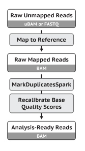
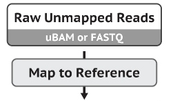
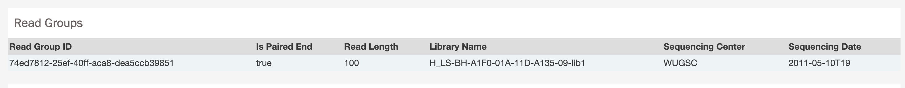
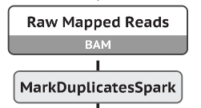
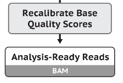

# Bioinformática Instrumental - Módulo II
# Identificação de Variantes Genéticas

## Aula04: Pré-processamento de dados genômicos  

Essa é uma etapa obrigatória que precede toda a descoberta de variantes. 
Envolve o pré-processamento dos dados brutos da sequência (geralmente obtidos no formato FASTQ) para produzir arquivos BAM prontos para análise. O principal passo é o alinhamento das sequências de leituras com um genoma de referência, bem como algumas operações de "limpeza" dos dados para corrigir vieses técnicos e torná-los mais adequados para chamada de variantes.

Utilizaremos como referência para a aula as boas práticas de pré-processamento preconizadas pelo [GATK](https://software.broadinstitute.org/gatk/) (_Genome Analysis Toolkit_):


>*The Genome Analysis Toolkit: a MapReduce framework for analyzing next-generation DNA sequencing data.* McKenna A, Hanna M, Banks E, Sivachenko A, Cibulskis K, Kernytsky A, Garimella K, Altshuler D, Gabriel S, Daly M, DePristo MA, 2010 GENOME RESEARCH 20:1297-303
 
>*From FastQ Data to High-Confidence Variant Calls: The Genome Analysis Toolkit Best Practices Pipeline.* Van der Auwera GA, Carneiro M, Hartl C, Poplin R, del Angel G, Levy-Moonshine A, Jordan T, Shakir K, Roazen D, Thibault J, Banks E, Garimella K, Altshuler D, Gabriel S, DePristo M, 2013 CURRENT PROTOCOLS IN BIOINFORMATICS 43:11.10.1-11.10.33  


**Fluxograma de trabalho desta aula prática:**  




A seguir, executaremos o passo-a-passo do pré-processamento dos dados:

### PASSO 1: ACESSO AO SERVIDOR REMOTO BIOINFO
Para relembrar como fazer a conexão ao servidor remoto via Putty, reveja os passos [aqui](https://github.com/cmasotti/BioinfoInstrumental-Aula04/blob/master/Acesso_servidor_remoto.pdf).

### PASSO 2: ORGANIZAR ESTRUTURA DE DIRETÓRIOS NO SERVIDOR REMOTO

No prompt da linha de comando no servidor remoto, criar diretórios para pré-processamento.

```bash  
aluno30@5b6864eb3f67:~$
aluno30@5b6864eb3f67:~$ mkdir preprocessing
aluno30@5b6864eb3f67:~$ cd preprocessing
aluno30@5b6864eb3f67:~/preprocessing$ mkdir hg38
aluno30@5b6864eb3f67:~/preprocessing$ mkdir mapping
aluno30@5b6864eb3f67:~/preprocessing$ mkdir alignment_metrics
aluno30@5b6864eb3f67:~/preprocessing$ mkdir markduplicates
aluno30@5b6864eb3f67:~/preprocessing$ mkdir references
aluno30@5b6864eb3f67:~/preprocessing$ mkdir bqsr
```  

Confira os diretórios criados:
```bash  
aluno30@5b6864eb3f67:~/preprocessing$ ls
alignment_metrics  bqsr  hg38  mapping  markduplicates  references
```  

### PASSO 3: PREPARAR O GENOMA DE REFERÊNCIA (Hg38)
 - Genoma de referência é um arquivo muito grande - trabalharemos com o genoma já pronto para a análise. 
 - Peculiaridades do hg38 em relação ao hg19 [HumanGenomeReferenceBuilds](https://gatkforums.broadinstitute.org/gatk/discussion/11010/human-genome-reference-builds-grch38-hg38-b37-hg19)
 - hg38.fa pode ser baixado a partir do repositório [GATK-Bundle](ftp://gsapubftp-anonymous@ftp.broadinstitute.org/bundle/). 
 - Uma vez disponível, é preciso indexar o hg38.fa de acordo com as exigências do mapper/caller que utilizaremos. O BWA requer um conjunto diferente de arquivos de índice para alinhamento e o comando abaixo cria cinco dos seis arquivos necessários (**.fai, .pac, .bwt, .ann, .amb, .sa**).
  
```bash   
aluno30@5b6864eb3f67:~/preprocessing$ bwa index

Usage:   bwa index [options] <in.fasta>

Options: -a STR    BWT construction algorithm: bwtsw, is or rb2 [auto]
         -p STR    prefix of the index [same as fasta name]
         -b INT    block size for the bwtsw algorithm (effective with -a bwtsw) [10000000]
         -6        index files named as <in.fasta>.64.* instead of <in.fasta>.* 

Warning: `-a bwtsw' does not work for short genomes, while `-a is' and
         `-a div' do not work not for long genomes.
```  
 - Confira os índices para análise:
```bash   
aluno30@5b6864eb3f67:~/preprocessing$ ls -ltr /mnt/dados/aula4/hg38/
```  
 >**hg38.25chrs.fa** (download GATK-budle)  
 >hg38.fa.fai, hg38.fa.amb, hg38.fa.ann, hg38.fa.bwt, hg38.fa.pac, hg38.fa.sa   

 - É preciso criar o arquivo hg38.dict,um dicionário das sequências de referência FASTA (Picard [CreateSequenceDictionary](https://software.broadinstitute.org/gatk/documentation/tooldocs/4.0.3.0/picard_sam_CreateSequenceDictionary.php))  

**Faça um link simbólico para o genoma referência e seus índices na sua pasta "preprocessing" e confira:**
```bash   
aluno30@5b6864eb3f67:~/preprocessing/hg38$ ln -s /mnt/dados/aula4/hg38/* .  
aluno30@5b6864eb3f67:~/preprocessing/hg38$ ls
```  

### PASSO 4: SALVAR E CONFERIR ARQUIVOS DE DADOS BRUTOS DE SEQUENCIAMENTO
Criar link simbólico para os arquivos FASTQs de dados públicos de câncer no diretório **/mapping**.
```bash   
aluno30@5b6864eb3f67:~/preprocessing$ cd mapping
aluno30@5b6864eb3f67:~/preprocessing/mapping$ ln -s /mnt/dados/aula4/raw/*fastq .
aluno30@5b6864eb3f67:~/preprocessing/mapping$ ls
```   

Explore os arquivos fastqs com head/tail:
```bash   
aluno30@5b6864eb3f67:~/preprocessing/mapping$ head TCGA-BH-A1F0-01A_BRCA_R1.fastq 
@HWI-ST467_110093165:5:2:11191:90620/1
CAGGCACAGCCAAGAGGGCTGAAGAAATGGTAGAACGGAGCAGCTGGTGATGTGTGGGCCCACCGGCCCCAGGCTCCTGTCTCCCCCCAGGGGGGTGGTG
+
9;;9?CCBEDDEDEBECCDEDBEECDEDDDBAECEE>DCEDDFEEDD?DABDAD?BAD?ADED<6B;7B,ADA:AB?0D@BDD?CAAD?E##########
```   

### PASSO 5: MAPEAMENTO

  

Para o correto maepamento, é preciso atribuir corretamente os nomes dos reads, ou "read groups".
>__Por que atribuir corretamente os read groups (RG)?__  
>Para diferenciar não apenas amostras, mas também características técnicas de artefatos. Com essas informações em mãos, podemos mitigar os efeitos desses artefatos durante as etapas de marcação de reads duplicados (PASSO 7) e BQSR (PASSO 8).[RG_required_by_GATK](https://software.broadinstitute.org/gatk/documentation/article?id=6472)  

Buscamos as informações das amostras aqui analisadas no repositório de dados do TCGA:  

>BREAST CANCER SAMPLE (TCGA-BH-A1F0)  
> - **WXS primary tumor** [TCGA-BH-A1F0-01A-11D-A135-09](https://portal.gdc.cancer.gov/files/68ada300-f0a2-447a-aa47-865770a80125)  
>  - **WXS adjacent normal tissue** [TCGA-BH-A1F0-01A-11D-A135-09](https://portal.gdc.cancer.gov/files/68ada300-f0a2-447a-aa47-865770a80125)  

  

**Executar a linha de comando a seguir (piped command line) para as duas amostras TCGA:**   
>TCGA-BH-A1F0-01A (WXS primary tumor)
```bash   
aluno30@5b6864eb3f67:~/preprocessing/mapping$ bwa mem -M -t4 -R '@RG\tID:74ed7812-25ef-40ff-aca8-dea5ccb39851\tSM:TCGA-BH-A1F0-01A\tPL:ILLUMINA\t' ../hg38/hg38.fa TCGA-BH-A1F0-01A_BRCA_R1.fastq TCGA-BH-A1F0-01A_BRCA_R2.fastq | samtools view -@4 -Sb - -O BAM -o TCGA-BH-A1F0-01A_BRCA.bam   
```  
>TCGA-BH-A1F0-11B (WXS normal tissue)
```bash   
aluno30@5b6864eb3f67:~/preprocessing/mapping$ bwa mem -M -t4 -R '@RG\tID:3ac135b5-f024-4534-a513-7adb9f04cc00\tSM:TCGA-BH-A1F0-11B\tPL:ILLUMINA\t' ../hg38/hg38.fa TCGA-BH-A1F0-11B_BRCA_R1.fastq TCGA-BH-A1F0-11B_BRCA_R2.fastq | samtools view -@4 -Sb - -O BAM -o TCGA-BH-A1F0-11B_BRCA.bam   
```   

Observe o que a segunda parte da linha de comando faz. 
Por que convertemos .sam para .bam?

Para prosseguir, também precisamos ordenar:
```bash   
aluno30@5b6864eb3f67:~/preprocessing/mapping$ samtools sort -@4 TCGA-BH-A1F0-01A_BRCA.bam -O BAM -o TCGA-BH-A1F0-01A_BRCA_sorted.bam  
aluno30@5b6864eb3f67:~/preprocessing/mapping$ samtools sort -@4 TCGA-BH-A1F0-11B_BRCA.bam -O BAM -o TCGA-BH-A1F0-11B_BRCA_sorted.bam  
```  
... e indexar nossos dados mapeados:
```bash   
aluno30@5b6864eb3f67:~/preprocessing/mapping$ samtools index -@2 TCGA-BH-A1F0-01A_BRCA_sorted.bam  
aluno30@5b6864eb3f67:~/preprocessing/mapping$ samtools index -@2 TCGA-BH-A1F0-11B_BRCA_sorted.bam  
```   

Confira o cabeçalho dos arquivos .bam com a linha de comando:
```bash   
aluno30@5b6864eb3f67:~/preprocessing/mapping$ samtools view -H TCGA-BH-A1F0-01A_BRCA_sorted.bam 
aluno30@5b6864eb3f67:~/preprocessing/mapping$ samtools view -H TCGA-BH-A1F0-11B_BRCA_sorted.bam 
```  

### PASSO 6: ANÁLISE DA QUALIDADE DO MAPEAMENTO  
Para avaliar a qualidade do mapeamento dos reads, executamos um script (em liguagem Java) do pacote de ferramentas Picard, o CollectAlignmentSummaryMetrics.

Para tanto, vá ao diretório /alignment_metrics e crie links simbólicos para os .bams mapeados, ordenados e indexados.
```bash   
aluno30@5b6864eb3f67:~/preprocessing/alignment_metrics$ cd ../alignment_metrics
aluno30@5b6864eb3f67:~/preprocessing/alignment_metrics$ ln -s ../mapping/*_sorted.bam . 
aluno30@5b6864eb3f67:~/preprocessing/alignment_metrics$ ln -s ../mapping/*_sorted.bam.bai .  
aluno30@5b6864eb3f67:~/preprocessing/alignment_metrics$ ls #confira os arquivos salvos
aluno30@5b6864eb3f67:~/preprocessing/alignment_metrics$ mkdir tmp_dir #repositório de arquivos temporários
```  
Para executar o CollectAlignmentSummaryMetrics, siga a linha de comando para cada amostra:
```bash   
aluno30@5b6864eb3f67:~/preprocessing/alignment_metrics$ java -Xmx8G -jar /usr/local/bin/picard.jar CollectAlignmentSummaryMetrics R=../hg38/hg38.fa I=TCGA-BH-A1F0-01A_BRCA_sorted.bam O=metrics_TCGA-BH-A1F0-01A_BRCA.txt TMP_DIR=tmp_dir 2> TCGA-BH-A1F0-01A_BRCA_CollectAlignmentSummaryMetrics.log &
```  

```bash   
aluno30@5b6864eb3f67:~/preprocessing/alignment_metrics$ java -Xmx8G -jar /usr/local/bin/picard.jar CollectAlignmentSummaryMetrics R=../hg38/hg38.fa I=TCGA-BH-A1F0-11B_BRCA_sorted.bam O=metrics_TCGA-BH-A1F0-11B_BRCA.txt TMP_DIR=tmp_dir 2> TCGA-BH-A1F0-11B_BRCA_CollectAlignmentSummaryMetrics.log &
```

O resultado será salvo nos arquivos de métricas de alinhamento. 
Explore com o comando ```less -S metrics_TCGA-BH-A1F0-11B_BRCA.txt```  
Observe o significado dos escores com base no link [CollectAlignmentSummaryMetrics](https://software.broadinstitute.org/gatk/documentation/tooldocs/current/picard_analysis_CollectAlignmentSummaryMetrics.php)


### PASSO 7: MARCAÇÃO DE READS DUPLICADOS
 

Nesta etapa, marcamos os reads duplicados com a ferramenta MarkDuplicates (Picard), que localiza e identifica reads duplicadas em um arquivo BAM ou SAM.   
 > Reads duplicados se originam de um único fragmento de DNA.   
 > Podem surgir duplicatas durante a construção da biblioteca usando PCR, por exemplo.
 > Leituras duplicadas também podem resultar de um único cluster de amplificação, detectado incorretamente como múltiplos clusters pelo sensor óptico do instrumento de seqüenciamento. Esses artefatos de duplicação são referidos como duplicados ópticos.   
 > Apenas marcaremos os reads duplicadas (a remoção é opcional).  
 
Execute as linhas de comando abaixo para marcar os reads duplicados: 
```bash  
aluno30@5b6864eb3f67:~/preprocessing/markduplicates$ mkdir tmp_dir #repositório de arquivos temporários
aluno30@5b6864eb3f67:~/preprocessing/markduplicates$ ln -s ../mapping/TCGA-BH-A1F0-*_BRCA_sorted.bam* . #link simbólico para .bams alinhados, ordenados e indexados
aluno30@5b6864eb3f67:~/preprocessing/markduplicates$ ls #confira os arquivos salvos
aluno30@5b6864eb3f67:~/preprocessing/markduplicates$ java -Xmx8G -jar /usr/local/bin/picard.jar MarkDuplicates INPUT=TCGA-BH-A1F0-01A_BRCA_sorted.bam OUTPUT=TCGA-BH-A1F0-01A_BRCA_dedup.bam METRICS_FILE=TCGA-BH-A1F0-01A_BRCA_dup.metrics OPTICAL_DUPLICATE_PIXEL_DISTANCE=2500 CREATE_INDEX=true TMP_DIR=tmp_dir 2> dedup_TCGA-BH-A1F0-01A_BRCA.log &
```  

```bash   
aluno30@5b6864eb3f67:~/preprocessing/markduplicates$ java -Xmx8G -jar /usr/local/bin/picard.jar MarkDuplicates INPUT=TCGA-BH-A1F0-11B_BRCA_sorted.bam OUTPUT=TCGA-BH-A1F0-11B_BRCA_dedup.bam METRICS_FILE=TCGA-BH-A1F0-11B_BRCA_dup.metrics OPTICAL_DUPLICATE_PIXEL_DISTANCE=2500 CREATE_INDEX=true TMP_DIR=tmp_dir 2> dedup_TCGA-BH-A1F0-11B_BRCA.log &
```  

O script também gera um arquivo de métricas, confira em [MarDuplicates](https://software.broadinstitute.org/gatk/documentation/tooldocs/4.0.4.0/picard_sam_markduplicates_MarkDuplicates.php).  
Explore com ```less -S TCGA-BH-A1F0-01A_BRCA_dup.metrics``` a proporção de reads duplicados, por exemplo.

### PASSO 8: BQSR (Base Quality Score Recalibration)


>Este passo detecta os erros sistemáticos cometidos pelo seqüenciador quando estima o escore de qualidade de cada base detectada.
>O **BQSR** aplica o aprendizado de máquina para modelar empiricamente esses erros e ajustar os escores de qualidade.

#### PASSO 8.1: BASE RECALIBRATOR (NÃO É TABAJARA!)  

>Gera tabela para recalibração para BQSR pelo script GATK [BaseRecalibrator](https://software.broadinstitute.org/gatk/documentation/tooldocs/current/org_broadinstitute_hellbender_tools_walkers_bqsr_BaseRecalibrator.php)  

>Identifica SNVs e INDELs polimórficos para ajustar escores, apoiado nos databases:  
 >-SNVs do [dbSNP](https://www.ncbi.nlm.nih.gov/snp/) **dbsnp_146.hg38.vcf**  
 >-Conjunto de indels conhecidas e validadas **Mills_and_1000G_gold_standard.indels.b37.sites.vcf**  
 
Vá ao diretório **/bqsr** e crie links simbólicos para esses datasets de referência e para os arquivos .bam com reads duplicados marcados de /markduplicates:  
```bash   
aluno30@5b6864eb3f67:~/preprocessing/bqsr$ ln -s /mnt/dados/aula4/references/Mills_and_1000G_gold_standard.indels.hg38.vcf* .  
aluno30@5b6864eb3f67:~/preprocessing/bqsr$ ln -s /mnt/dados/aula4/references/dbsnp_146.hg38.vcf* .  
aluno30@5b6864eb3f67:~/preprocessing/bqsr$ ln -s ../markduplicates/TCGA-BH-A1F0-*dedup.bam . 
aluno30@5b6864eb3f67:~/preprocessing/bqsr$ ln -s ../markduplicates/TCGA-BH-A1F0-*dedup.bai .   
aluno30@5b6864eb3f67:~/preprocessing/bqsr$ ls # confira os arquivos salvos
```  
Execute a linha de comando a seguir para as duas amostras TCGA:
```bash   
aluno30@5b6864eb3f67:~/preprocessing/bqsr$ gatk BaseRecalibrator -I TCGA-BH-A1F0-01A_BRCA_dedup.bam -R ../hg38/hg38.fa --known-sites dbsnp_146.hg38.vcf --known-sites Mills_and_1000G_gold_standard.indels.hg38.vcf -O recal_TCGA-BH-A1F0-01A_BRCA.table 2> BaseRecalibrator_TCGA-BH-A1F0-01A_BRCA.log &   
```bash   
aluno30@5b6864eb3f67:~/preprocessing/bqsr$ gatk BaseRecalibrator -I TCGA-BH-A1F0-11B_BRCA_dedup.bam -R ../hg38/hg38.fa --known-sites dbsnp_146.hg38.vcf --known-sites Mills_and_1000G_gold_standard.indels.hg38.vcf -O recal_TCGA-BH-A1F0-11B_BRCA.table  2> BaseRecalibrator_TCGA-BH-A1F0-11B_BRCA.log &   
 ```
Observe os comandos ```2> XXX.log```. Qual é a sua utilidade?   

#### PASSO 8.2: APLICAR BQSR   
Nesta etapa, recalibramos os novos escores com o script [GATK-ApplyBQSR](https://software.broadinstitute.org/gatk/documentation/tooldocs/current/org_broadinstitute_hellbender_tools_walkers_bqsr_ApplyBQSR.php)  
> As variantes conhecidas são usadas para mascarar bases em locais de variação polimórfica real (esperada).  

Execute a linha de comando para as duas amostras TCGA, usando as tabelas geradas pelo **BaseRecalibrator** (recal_TCGA-BH-A1F0-XX_BRCA.table:  

```bash   
aluno30@5b6864eb3f67:~/preprocessing/bqsr$ gatk ApplyBQSR -I TCGA-BH-A1F0-01A_BRCA_dedup.bam -R ../hg38/hg38.fa --bqsr-recal-file recal_TCGA-BH-A1F0-01A_BRCA.table -O TCGA-BH-A1F0-01A_BRCA_bqsr.bam 2> ApplyBQSR_TCGA-BH-A1F0-01A_BRCA.log &
aluno30@5b6864eb3f67:~/preprocessing/bqsr$  
aluno30@5b6864eb3f67:~/preprocessing/bqsr$ gatk ApplyBQSR -I TCGA-BH-A1F0-11B_BRCA_dedup.bam -R ../hg38/hg38.fa --bqsr-recal-file recal_TCGA-BH-A1F0-11B_BRCA.table -O TCGA-BH-A1F0-11B_BRCA_bqsr.bam 2> ApplyBQSR_TCGA-BH-A1F0-11B_BRCA.log &  
```

Após a conclusão dessa etapa, temos os arquivos prontos para iniciar a chamada de variantes propriamente dita.


